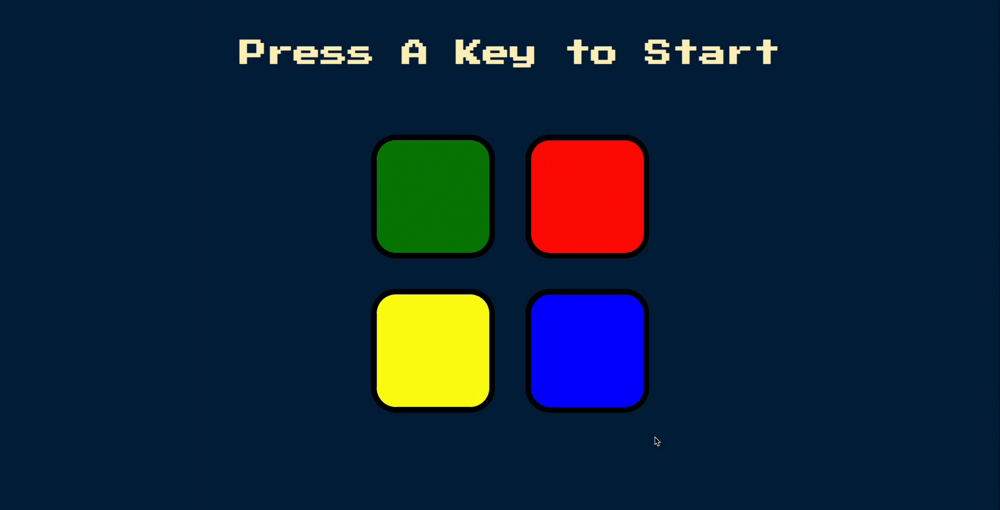

# Simon - Game

## Description

A simple simon game application designed with jQuery.

Simon Game is an electronic game to use to test your memory and visual reflexes. Its purpose is to provide an error-free imitation of the color sequence of an electronic device called Simon.

The game has a panel of four colors: blue, red, green and yellow. Simon shows a color sequence in each turn and asks you to repeat this sequence.

If the colors are pressed in the correct order, the difficulty level of the game increases by passing to the next level, thus making memory and reflexes more difficult in the following sections.

If the user presses a wrong color button, the game is over and the user has to start over.

### To play Simon game, follow these steps;

- Turn on the game by pressing the power button.
- The game will play a sequence of colors (or tones), which you should try to memorize.
- Once the sequence is complete, repeat the sequence back by pressing the same color (or tone) buttons in the same order.
- If you successfully repeat the sequence, the game will play a longer sequence in the next round.
- If you make a mistake, the game will produce a wrong buzzer sound and the game will be over.
- The game will keep playing longer and longer sequences as you progress, and you should keep repeating the sequences back correctly to keep playing.

## Used Technologies

- HTML5
- CSS3
- JAVASCRIPT
- JQuery

# Simon Game View

